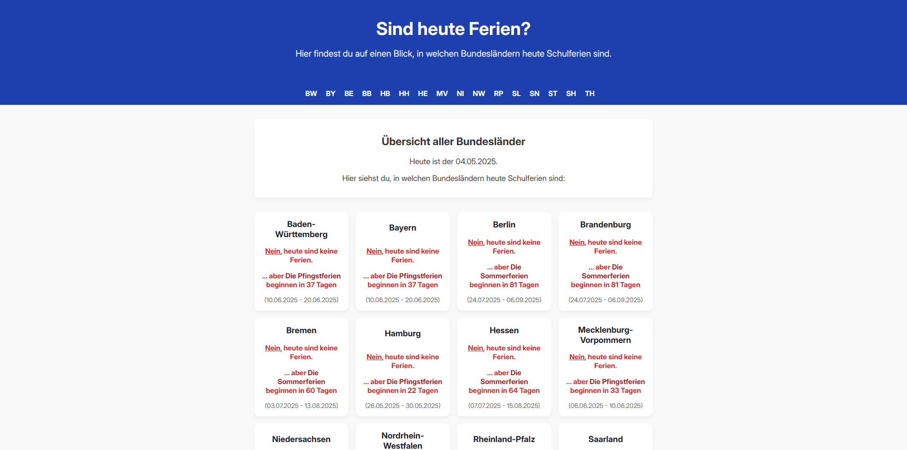

# SindHeuteFerien.de

Ein Projekt um schnell herauszufinden, wo und wann die nächsten Ferien sind. Ohne mühsam Tabellen auslesen zu müssen.

## Screenshot

### SEO

Das Projekt hat zwei Missionen: Für mich soll es ein Spielplatz sein, um mit SEO zu experimentieren, und für Deutschland ein hilfreiches, großartiges Werkzeug.

### Code-Style

Zugegeben, der Code ist an vielen Stellen ziemlich schlampig und einfach heruntergerattert (Stand Commit #1). Er wird aber bereits von @dezio aufgeräumt und verbessert. Wenn Du auch Lust hast, mitzuhelfen, sind wir für Pull Requests jederzeit offen.

### Wie finanziert sich der Spaß?

Erstmal durch mich, Freude am Projekt, meinen Servern von [BoxSRV.net](https://BoxSRV.net) & später ggf. mit Adsense Einblendungen.
